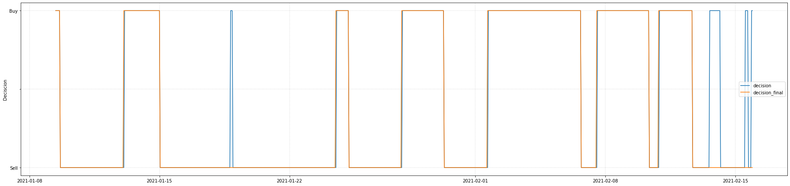

# Training-neural-networks-to-predict-crypto-price-movements


In the following, I want to download historical crypto data, calculate a classification of when is a good time to buy, export price data as CandleCharts, then perform supervised learning based on the classification, and ultimately then make predictions using the model


## Classification
### Load and prepare historical data from https://www.cryptodatadownload.com/data/. I choose the binance exchange

````python
import pandas as pd
import numpy as np
import matplotlib.pyplot as plt


url="https://www.cryptodatadownload.com/cdd/Binance_BTCUSDT_1h.csv"
data =pd.read_csv(url, skiprows=1) 
data.drop(['date', 'symbol', 'Volume USDT', 'tradecount'], axis=1, inplace = True) # Delete unnecessary data
data['unix'] = data['unix'].astype(str).str[:10] # Manual adjustment of the time dataset - If Unixtime has more than 10 digits, it must be divided by 1000
data['date'] =   pd.to_datetime(data.unix, unit='s') # Convert dates. Attention UNIX EPOCH time has three 0's too many.
data = data.iloc[::-1] # flip upside down
data.reset_index(drop=True, inplace = True) # Create a new index
data
````

| |	unix	| open	| high |	low |	close |	Volume BTC |	date |
|     :---:      | :---:      | :---:      | :---:      | :---:      | :---:      | 	:---:      | 	:---:      | 	
| 0 |	1502946000 | 4308.83 |	4328.69 |	4291.37 |	4315.32 |	23.230000 |	2017-08-17 05:00:00 |	
| 1 | 1502949600 | 4315.32 | 4345.45 | 4309.37 | 4324.35 | 7.230000 | 2017-08-17 06:00:00 |
| 2 | 1502953200 | 4324.35 | 4349.99 | 4287.41 | 4349.99 | 4.440000 | 2017-08-17 07:00:00 |


Here is a plot of the price development

````python
# figure
fig, ax1 = plt.subplots(figsize=(15,6))
ax1.grid(color='black', linestyle='--', linewidth=0.1)
ax1.set_xlabel('date')
ax1.set_ylabel('Value in USD')
ax1.plot(data.date, data.close, label='BTC')
ax1.tick_params(axis='y')
ax1.legend()
fig.tight_layout()  # otherwise the right y-label is slightly clipped
````


### Classification when a good entry point is in place
I would like to train the model so that he buys at good times if possible and sells when the price goes down. For this I have thought of the following logic:

If for time span x hours (e.g. 24h) the price increases by y percent (e.g. 2 %), then the range must be labeled as a good entry point
However, since the price is very volatile, I calculate two moving averages

Create moving averages


````python
average_length_current = 60 # in hours
average_length_future = 24  # in hours
distance_time =  2          # in hours x-axis
distance_value = 2          # in precent y-axis
distance_value = 1+(distance_value/100) # 

# create moving averages
data['average_length_current'] = data.loc[:,"close"].rolling(window=average_length_current).mean()
data['average_length_future'] =  data.loc[:,"close"].rolling(window=average_length_future).mean()
data.tail()
````

 | | unix | open | high | low | close | Volume BTC | date | average_length_current | average_length_future  | 
 |     :---:      | :---:      | :---:      | :---:      | :---:      | :---:      | 	:---:      | 	:---:      | 		:---:      | 		:---:      | 	
 | 33351 | 1613505600 | 48536.35 | 48784.29 | 48173.81 | 48769.27 | 2584.417826 | 2021-02-16 20:00:00 | 48454.874000 | 48785.043333  | 
 | 33352 | 1613509200 | 48769.28 | 48809.09 | 48355.80 | 48575.07 | 2220.458707 | 2021-02-16 21:00:00 | 48445.553000 | 48800.357083 | 
 | 33353 | 1613512800 | 48575.06 | 49180.00 | 48524.65 | 49108.68 | 1763.412213 | 2021-02-16 22:00:00 | 48446.960833 | 48834.681667 |
 | 33354 | 1613516400 | 49113.91 | 49290.00 | 48933.33 | 49133.45 | 1959.461793 | 2021-02-16 23:00:00 | 48448.265667 | 48885.612917 | 
 | 33355 | 1613520000 | 49133.45 | 49476.00 | 49133.44 | 49361.52 | 615.901013 | 2021-02-17 00:00:00 | 48447.010000 | 48956.133750 | 


### Plot Moving averages

````python
# Moving Average
fig, ax1 = plt.subplots(figsize=(25,6))
ax1.grid(color='black', linestyle='--', linewidth=0.1)
ax1.set_ylabel('Value in USD')
ax1.plot(data.date[-900:], data.close[-900:], label='BTC')
ax1.plot(data.date[-900:], data.average_length_current[-900:], label='BTC-Average_length_current')
ax1.plot(data.date[-900:], data.average_length_future[-900:], label='BTC-Average_length_future')
ax1.tick_params(axis='y')
ax1.legend()
fig.tight_layout()  # otherwise the right y-label is slightly clipped
````


### Decision making

If the future price increases by a certain percentage (distance_value), then mark the current price as a good buying opportunity.
If the future price falls, then this should be taken as a selling argument.
Caution: This works only because I have the historical data

Calculate buy or sell condition  - 1 means buy / -1 means sell
Decision formula

````python
data['decision'] = 0 # initialization
for x in range(0, len(data)-distance_time-average_length_future):
    if data.average_length_current[x]*distance_value < data.average_length_future[x+distance_time+average_length_future]:
        data['decision'][x] = 1
    elif data.average_length_current[x]*distance_value > data.average_length_future[x+distance_time+average_length_future]:
        data['decision'][x] = -1
    else:
        data['decision'][x] = 0
data.tail()
````

 | | unix | open | high | low | close | Volume BTC | date | average_length_current | average_length_future  | decision | 
 |     :---:      | :---:      | :---:      | :---:      | :---:      | :---:      | 	:---:      | 	:---:      | 		:---:      | 		:---:      | 			:---:      | 	
 | 33351 | 1613505600 | 48536.35 | 48784.29 | 48173.81 | 48769.27 | 2584.417826 | 2021-02-16 20:00:00 | 48454.874000 | 48785.043333  | 0 |
 | 33352 | 1613509200 | 48769.28 | 48809.09 | 48355.80 | 48575.07 | 2220.458707 | 2021-02-16 21:00:00 | 48445.553000 | 48800.357083 | 0 |
 | 33353 | 1613512800 | 48575.06 | 49180.00 | 48524.65 | 49108.68 | 1763.412213 | 2021-02-16 22:00:00 | 48446.960833 | 48834.681667 | 0 |
 | 33354 | 1613516400 | 49113.91 | 49290.00 | 48933.33 | 49133.45 | 1959.461793 | 2021-02-16 23:00:00 | 48448.265667 | 48885.612917 | 0 |
 | 33355 | 1613520000 | 49133.45 | 49476.00 | 49133.44 | 49361.52 | 615.901013 | 2021-02-17 00:00:00 | 48447.010000 | 48956.133750 | 0 |
 
 This plot shows when was a good time to take a long position
 
 
 ````python
 # Decision
fig, ax1 = plt.subplots(figsize=(25,6))
ax1.grid(color='black', linestyle='--', linewidth=0.1)
ax1.set_ylabel('Deciscion')
ax1.plot(data.date[-900:], data.decision[-900:], label='Decision')
ax1.tick_params(axis='y')
plt.yticks(np.arange(-1,2))
y_ticks_labels = ['Sell','','Buy']
ax1.set_yticklabels(y_ticks_labels)
ax1.legend()
fig.tight_layout()  # otherwise the right y-label is slightly clipped
````


Here again with the overview the moving averages. The model works on the whole very well, but fast breakouts to the top are not well perceived

````python
fig, ax1 = plt.subplots(figsize=(25,6))
ax1.grid(color='black', linestyle='--', linewidth=0.1)
color1 = 'tab:red'
ax1.set_xlabel('date')
ax1.set_ylabel('value in USD', color=color1)
ax1.plot(data.date[-900:], data.close[-900:], label='BTC', color=color1)
ax1.plot(data.date[-900:], data.average_length_current[-900:], label='BTC_ma_c')
ax1.plot(data.date[-900:], data.average_length_future[-900:], label='BTC_ma_f')
ax1.tick_params(axis='y', labelcolor=color1)
ax1.legend()
ax2 = ax1.twinx()  # instantiate a second axes that shares the same x-axis
color2 = 'tab:blue'
ax2.set_ylabel('decision', color=color2)  # we already handled the x-label with ax1
ax2.plot(data.date[-900:], data.decision[-900:], label='Decision', color=color2)
ax2.tick_params(axis='y', labelcolor=color2)
ax2.set_yticks(np.arange(-1,2))
y_ticks_labels = ['Sell','','Buy']
ax2.set_yticklabels(y_ticks_labels)
ax2.legend()
fig.tight_layout()  # otherwise the right y-label is slightly clipped
````


The beginning of the dataset can not be recommended, because no idea whether good or bad, you do not know which value (current or future) first starts therefore all 0 entries in the deciscion column will be deleted

````python
data.drop(data.loc[data['decision']== 0].index, inplace=True)
data.reset_index(drop=True, inplace = True) # Create a new index
data
````

| | unix | open | high | low | close | Volume BTC | date | average_length_current | average_length_future  | decision | 
 |     :---:      | :---:      | :---:      | :---:      | :---:      | :---:      | 	:---:      | 	:---:      | 		:---:      | 		:---:      | 			:---:      | 	
 |0 | 1503154800 | 4042.41 | 4063.44 | 3964.67 | 3972.05 | 8.150000 | 2017-08-19 15:00:00 | 4229.466500 | 4077.647500 | -1 |
 |1 | 1503158400 | 3972.05 | 4049.69 | 3953.40 | 4000.00 | 3.750000 | 2017-08-19 16:00:00 | 4224.319333 | 4067.216667 | -1 |
 |2 | 1503162000 | 4000.00 | 4048.99 | 3976.72 | 4027.37 | 3.070000 | 2017-08-19 17:00:00 | 4219.520167 | 4060.300833 | -1 |
 |3 | 1503165600 | 4027.37 | 4096.00 | 4013.69 | 4086.29 | 16.960000 | 2017-08-19 18:00:00 | 4215.552500 | 4059.004167 | -1 |
 |4 | 1503169200 | 4086.29 | 4103.92 | 4073.47 | 4076.12 | 1.620000 | 2017-08-19 19:00:00 | 4210.988000 | 4056.497500 | -1 |
 |... | ... | ... | ... | ... | ... | ... | ... | ... | ... | ... |
 |33266 | 1613412000 | 48562.31 | 48698.52 | 48342.22 | 48358.99 | 2040.898434 | 2021-02-15 18:00:00 | 47838.691333 | 47922.434583 | -1 |
 |33267 | 1613415600 | 48361.00 | 48742.52 | 48354.78 | 48657.31 | 1945.428372 | 2021-02-15 19:00:00 | 47866.384500 | 47920.931250 | -1 |
 |33268 | 1613419200 | 48657.31 | 48801.00 | 48453.87 | 48580.99 | 3063.153399 | 2021-02-15 20:00:00 | 47885.568833 | 47906.410000 | -1 |
 |33269 | 1613422800 | 48581.00 | 48750.00 | 48111.11 | 48207.54 | 2767.082753 | 2021-02-15 21:00:00 | 47902.269000 | 47880.780000 | 1 |
 |33270 | 1613426400 | 48201.18 | 48334.23 | 47643.00 | 48284.89 | 2835.289841 | 2021-02-15 22:00:00 | 47928.531000 | 47850.444583 | 1 |

### Next, I want to know how well this method works, so I calculate how my capital would develop

Create clear recommendation matrix with purchase date & purchase values


````python
recommendation = pd.DataFrame((np.zeros((0,4))), columns = ['time', 'data_index', 'close', 'decision']) 
k = 0
for x in range(0, len(data)-1):
    if data.decision[x] > data.decision[x+1]:
        recommendation.loc[k,"time"] = data.date[x]
        recommendation.loc[k,"data_index"] = data.index[x]
        recommendation.loc[k,"close"] = data.close[x]
        recommendation.loc[k,"decision"] = -1
    if data.decision[x] < data.decision[x+1]:
        recommendation.loc[k,"time"] = data.date[x]
        recommendation.loc[k,"data_index"] = data.index[x]
        recommendation.loc[k,"close"] = data.close[x]
        recommendation.loc[k,"decision"] = 1
    k = k + 1
recommendation.reset_index(drop=True, inplace = True) # Create a new index
recommendation
````
  | | time | data_index | close | decision  |
  |     :---:      | :---:      | :---:      | :---:      | :---:      | 
 |0 | 2017-08-22 13:00:00 | 70.0 | 3920.99 | 1.0  |
 |1 | 2017-08-25 14:00:00 | 143.0 | 4305.00 | -1.0  |
 |2 | 2017-08-28 14:00:00 | 215.0 | 4291.13 | 1.0  |
 |3 | 2017-09-01 12:00:00 | 309.0 | 4793.00 | -1.0  |
 |4 | 2017-09-05 10:00:00 | 403.0 | 4169.76 | 1.0  |
 |... | ... | ... | ... | ...  |
 |352 | 2021-02-13 14:00:00 | 33214.0 | 46946.90 | 1.0  |
 |353 | 2021-02-14 04:00:00 | 33228.0 | 47551.25 | -1.0  |
 |354 | 2021-02-15 12:00:00 | 33260.0 | 47951.01 | 1.0  |
 |355 | 2021-02-15 16:00:00 | 33264.0 | 48494.96 | -1.0  |
 |356 | 2021-02-15 20:00:00 | 33268.0 | 48580.99 | 1.0  |

Clean up matrix so that it always starts with a buy (1) and ends with a sell

````python
if recommendation.iloc[0,-1] == -1:
    recommendation.drop(recommendation.index[0], inplace=True)
if recommendation.iloc[-1,-1] == 1:
    recommendation.drop(recommendation.index[-1], inplace=True)
recommendation
````
  | | time | data_index | close | decision  |
  |     :---:      | :---:      | :---:      | :---:      | :---:      | 
 |0 | 2017-08-22 13:00:00 | 70.0 | 3920.99 | 1.0  |
 |1 | 2017-08-25 14:00:00 | 143.0 | 4305.00 | -1.0  |
 |2 | 2017-08-28 14:00:00 | 215.0 | 4291.13 | 1.0  |
 |3 | 2017-09-01 12:00:00 | 309.0 | 4793.00 | -1.0  |
 |4 | 2017-09-05 10:00:00 | 403.0 | 4169.76 | 1.0  |
 |... | ... | ... | ... | ...  |
 |352 | 2021-02-13 14:00:00 | 33214.0 | 46946.90 | 1.0  |
 |353 | 2021-02-14 04:00:00 | 33228.0 | 47551.25 | -1.0  |
 |354 | 2021-02-15 12:00:00 | 33260.0 | 47951.01 | 1.0  |
 |355 | 2021-02-15 16:00:00 | 33264.0 | 48494.96 | -1.0  |
 
 ### Summary of capital development
 
 ````python
 capital_development = pd.DataFrame((np.zeros((0,7))), columns = ['buy_time', 'buy_data_index', 'buy_close', 'sell_time', 'sell_data_index', 'sell_close','performance'])
k = 0
for x in range(0, len(recommendation)):
    if recommendation.decision[x] == 1:
        capital_development.loc[k,"buy_time"] = recommendation.time[x]
        capital_development.loc[k,"buy_data_index"] = recommendation.data_index[x]
        capital_development.loc[k,"buy_close"] = recommendation.close[x]
        capital_development.loc[k,"sell_time"] = recommendation.time[x+1]
        capital_development.loc[k,"sell_data_index"] = recommendation.data_index[x+1]
        capital_development.loc[k,"sell_close"] = recommendation.close[x+1]
        capital_development.loc[k,"performance"] = capital_development.loc[k,"sell_close"]/capital_development.loc[k,"buy_close"]
    k = k + 1
capital_development.reset_index(drop=True, inplace = True) # Create a new index
capital_development
````
| | buy_time | buy_data_index | buy_close | sell_time | sell_data_index | sell_close | performance |
|    :---:      | :---:      | :---:      | :---:      | :---:      |  :---:      | :---:      | :---:      |
|0 | 2017-08-22 13:00:00 | 70.0 | 3920.99 | 2017-08-25 14:00:00 | 143.0 | 4305.00 | 1.097937 |
|1 | 2017-08-28 14:00:00 | 215.0 | 4291.13 | 2017-09-01 12:00:00 | 309.0 | 4793.00 | 1.116955 |
|2 | 2017-09-05 10:00:00 | 403.0 | 4169.76 | 2017-09-07 16:00:00 | 457.0 | 4705.03 | 1.128369 |
|3 | 2017-09-15 10:00:00 | 643.0 | 2950.00 | 2017-09-16 03:00:00 | 660.0 | 3770.00 | 1.277966 |
|4 | 2017-09-16 14:00:00 | 671.0 | 3630.00 | 2017-09-19 16:00:00 | 745.0 | 3961.90 | 1.091433 |
|... | ... | ... | ... | ... | ... | ... | ... |
|173 | 2021-02-01 16:00:00 | 32929.0 | 33460.83 | 2021-02-06 16:00:00 | 33049.0 | 40608.76 | 1.213621 |
|174 | 2021-02-07 13:00:00 | 33070.0 | 38629.26 | 2021-02-10 08:00:00 | 33137.0 | 46668.89 | 1.208123 |
|175 | 2021-02-10 21:00:00 | 33150.0 | 44999.09 | 2021-02-12 16:00:00 | 33192.0 | 47614.40 | 1.058119 |
|176 | 2021-02-13 14:00:00 | 33214.0 | 46946.90 | 2021-02-14 04:00:00 | 33228.0 | 47551.25 | 1.012873 |
|177 | 2021-02-15 12:00:00 | 33260.0 | 47951.01 | 2021-02-15 16:00:00 | 33264.0 | 48494.96 | 1.011344 |


 If capital development performance is below a threshold value, this entry is deleted again, so that this is not learned by the DL. Changes in equity is in column 7, find the value that is smaller than the target value, then delete the entire line.
 
 ````python 
 capital_development = capital_development[capital_development.performance > distance_value]
capital_development.reset_index(drop=True, inplace = True) # Create a new index
capital_development
````
  || buy_time | buy_data_index | buy_close | sell_time | sell_data_index | sell_close | performance |
  |     :---:      | :---:      | :---:      | :---:      | :---:      |  :---:      | :---:      | :---:      |
|0 | 2017-08-22 13:00:00 | 70.0 | 3920.99 | 2017-08-25 14:00:00 | 143.0 | 4305.00 | 1.097937|
|1 | 2017-08-28 14:00:00 | 215.0 | 4291.13 | 2017-09-01 12:00:00 | 309.0 | 4793.00 | 1.116955|
|2 | 2017-09-05 10:00:00 | 403.0 | 4169.76 | 2017-09-07 16:00:00 | 457.0 | 4705.03 | 1.128369|
|3 | 2017-09-15 10:00:00 | 643.0 | 2950.00 | 2017-09-16 03:00:00 | 660.0 | 3770.00 | 1.277966|
|4 | 2017-09-16 14:00:00 | 671.0 | 3630.00 | 2017-09-19 16:00:00 | 745.0 | 3961.90 | 1.091433|
|... | ... | ... | ... | ... | ... | ... | ...|
|148 | 2021-01-24 12:00:00 | 32733.0 | 32362.31 | 2021-01-25 04:00:00 | 32749.0 | 33378.93 | 1.031414|
|149 | 2021-01-28 01:00:00 | 32818.0 | 30881.94 | 2021-01-30 07:00:00 | 32872.0 | 34046.80 | 1.102483|
|150 | 2021-02-01 16:00:00 | 32929.0 | 33460.83 | 2021-02-06 16:00:00 | 33049.0 | 40608.76 | 1.213621|
|151 | 2021-02-07 13:00:00 | 33070.0 | 38629.26 | 2021-02-10 08:00:00 | 33137.0 | 46668.89 | 1.208123|
|152 | 2021-02-10 21:00:00 | 33150.0 | 44999.09 | 2021-02-12 16:00:00 | 33192.0 | 47614.40 | 1.058119|
 
 
 If you now multiply every entry of the performance column with each other (product), you get the amount by how much your investment has multiplied. However, with each purchase and sale also fees arise, which were not related here.
 ````python 
 round(capital_development['performance'].product(), 2)
3336150.44
````
Now the values that indicate a good buying opportunity have to be finally classified in order to plot images on them. For this purpose I have included the index of the imported data in the DataFramce capital_development
````python
data['decision_final'] = -1 # Create a new column with initiated sell signal 
for x in range(0, len(capital_development)):
    data.loc[capital_development.iloc[x,1]:capital_development.iloc[x,4],"decision_final"] = 1
````
Plot 
````python
# Decision
fig, ax1 = plt.subplots(figsize=(25,6))
ax1.grid(color='black', linestyle='--', linewidth=0.1)
ax1.set_ylabel('Deciscion')
ax1.plot(data.date[-900:], data.decision[-900:], label='decision')
ax1.plot(data.date[-900:], data.decision_final[-900:], label='decision_final')
ax1.tick_params(axis='y')
plt.yticks(np.arange(-1,2))
y_ticks_labels = ['Sell','','Buy']
ax1.set_yticklabels(y_ticks_labels)
ax1.legend()
fig.tight_layout()  # otherwise the right y-label is slightly clipped
````



```` python
# save pandas as CSV
file_name = "classification.csv"
data.to_csv (file_name, index = False, header=True)
````


After that I want to create figures to train the model. 
For this, I again look at individual time windows and create mapping from them. Through the calculated decision support, I can then assign to the model whether a good or bad opportunity for a long position exists.


## Create figures and train model


````python
import os
from os import listdir
from os import makedirs
from os.path import isfile, join
import sys

import pandas as pd
import numpy as np
import math
import shutil

from datetime import datetime
import datetime 
from PIL import Image

import uuid
#plt.style.use('ggplot')
#%matplotlib inline

import matplotlib.pyplot as plt
import matplotlib.dates as mdates
import matplotlib.dates as mpl_dates
import matplotlib.pyplot as plt
#from matplotlib import pyplot

from mpl_finance import candlestick_ohlc

from keras.utils import to_categorical
from keras.applications.vgg16 import VGG16
from keras.models import Model
from keras.layers import Dense
from keras.layers import Flatten
from keras.optimizers import SGD
from keras.preprocessing.image import ImageDataGenerator
````
Folders must be properly set up

````python
path_ = 'D:/your path where you want to store your figures/'

average_length_current = 60 # in hours
average_length_future = 24  # in hours
distance_time =  2          # in hours x-axis
distance_value = 2          # in precent y-axis
distance_value = 1+(distance_value/100) # 
parameter = ['60_24_2_1.02'] # Folder [average_length_current average_length_future distance_time distance_value]

for i in parameter:
    path_parameter = path_ + i + '/'
    print('Subdirectories were created in ' + path_parameter)
    subdirs = ['export/', 'train/', 'validation/']
    for subdir in subdirs:
        labeldirs = ['Var1/', 'Var2/']
        for labldir in labeldirs:
            newdir = path_parameter + subdir + labldir
            makedirs(newdir, exist_ok=True)
    subdirs = ['chrono/']
    for subdir in subdirs:
        newdir = path_parameter + subdir
        makedirs(newdir, exist_ok=True)
````
The classification file that was created earlier is loaded here again

```` python
csv_file = 'classification.csv'

# Load data
float_formatter = "{:.2f}".format
np.set_printoptions(formatter={'float_kind':float_formatter})
dataset = []
dataset = pd.read_csv(csv_file, index_col=False)
dataset['date'] = pd.to_datetime(dataset['date']) # convert object / string to datetime
````

### Candlestick chart must be created to train the neural network

For this purpose, the past 60 hours are considered and a figure is created from them. For a better result, the image should be filled with more features, here I added the moving averages. But also indicators like resistances or trend channels can be added.

Images that represent a good buy or sell signal are stored in different folders depending on their previous classification. 

````python
for k in range(average_length_current-1,len(dataset)):
    extract = dataset.iloc[k-average_length_current+1:k+1]
    f = lambda x: mdates.date2num(datetime.datetime.fromtimestamp(x)) # damit candlestick funktioniert, muss die Zeit in matplotlib umgewandelt werden
    fig, ax = plt.subplots(num=1, figsize=(3, 3), dpi=80, facecolor='w', edgecolor='k')
    ohlc = list(zip(extract['unix'].apply(f), extract['open'],extract['high'],extract['low'],extract['close'], extract['Volume BTC']))
    candlestick_ohlc(ax, ohlc, colorup='#77d879', colordown='#db3f3f', width = 0.05, alpha=0.5)
    plt.plot(extract['date'],extract['average_length_current'], color="b", linewidth=5, alpha=0.5)
    plt.plot(extract['date'],extract['average_length_future'], color="c", linewidth=5, alpha=0.5)
    ############### Add more identifying features ###############
    plt.autoscale()
    plt.axis('off')
    # Save the figures according to the classification in Buy and Sell
    if extract.iloc[-1,-1] == -1: #sell 
        plt.savefig(path_parameter + 'export/Var1/' + str(uuid.uuid4())+'.jpg') # assign random names so that no order can be determined
    elif extract.iloc[-1,-1] == 1: #buy
        plt.savefig(path_parameter + 'export/Var2/' + str(uuid.uuid4())+'.jpg') # assign random names so that no order can be determined
    plt.cla()
    plt.clf()
````
For my data set up to and including February 17, 2021, 9.269 figures have now been created as a buy signal and 23,943 as a sell signal. An example figure is shown below


### Adjusted all images to the correct format
In order for the images to be used for training, they must be put into a proper format

````python
new_hight = 224
new_width = 224
var = ['export/var1/', 'export/var2/']
def resize():
        for item in dirs:
            if os.path.isfile(path+item):
                im = Image.open(path+item)
                f, e = os.path.splitext(path+item)
                width, height = im.size  
                if width != new_width:
                    if height != new_hight:
                        #print(width, height) 
                        imResize = im.resize((new_hight,new_width), Image.ANTIALIAS)
                        imResize.save(f + '.jpg', 'JPEG', quality=100)

for x in var:
    path = path_parameter + x
    dirs = os.listdir(path)
    resize()
````
### Start storing images in the right way
80% of the data is used for training. 20% (split_factor) is used for validation, for which the images are moved to the appropriate folders

````python 
var = ['var1', 'var2']
split_factor = 0.2
for x in var:
    exportdir = path_parameter + 'export/' + x + '/'
    traindir = path_parameter + 'train/' + x + '/'
    validir  = path_parameter + 'validation/' + x + '/'

    # cut the files from the export and paste them into the training folder
    FileList = [f for f in listdir(exportdir) if isfile(join(exportdir, f))]
    Quantity_to_move = math.ceil(len(FileList))
    for x in range(0, Quantity_to_move):
        source_name = (exportdir + FileList[x])
        target_name = (traindir + FileList[x])
        shutil.move(source_name, target_name)
    # cut 20% of the files from trian and paste them into validation folder
    FileList = [f for f in listdir(traindir) if isfile(join(traindir, f))]
    Quantity_to_move = math.ceil(len(FileList)*split_factor)
    for x in range(0, Quantity_to_move):
        source_name = (traindir + FileList[x])
        target_name = (validir + FileList[x])
        shutil.move(source_name, target_name)
 ````
 ### Train Model
 To train the model, I take very good pre-trained model (VGG16). Then the model is trained based on the saved figures
 
 ````python
 def define_model():
    model = VGG16(include_top=False, input_shape=(224, 224, 3)) # load model
    for layer in model.layers: # mark loaded layers as not trainable
        layer.trainable = False # mark loaded layers as not trainable
    flat1 = Flatten()(model.layers[-1].output) # add new classifier layers
    class1 = Dense(128, activation='relu', kernel_initializer='he_uniform')(flat1)
    output = Dense(1, activation='sigmoid')(class1)
    model = Model(inputs=model.inputs, outputs=output) # define new model
    opt = SGD(lr=0.001, momentum=0.9) # compile model
    model.compile(optimizer=opt, loss='binary_crossentropy', metrics=['accuracy'])
    return model

def run_test_harness():
    model = define_model() # define model
    datagen = ImageDataGenerator(featurewise_center=True) # create data generator
    datagen.mean = [123.68, 116.779, 103.939] # specify imagenet mean values for centering
    train_it = datagen.flow_from_directory(path_parameter + 'train/', 
        class_mode='binary', batch_size=64, target_size=(224, 224)) # prepare iterator
    test_it = datagen.flow_from_directory(path_parameter + 'validation/',
        class_mode='binary', batch_size=64, target_size=(224, 224))
    history = model.fit_generator(train_it, steps_per_epoch=len(train_it),
        validation_data=test_it, validation_steps=len(test_it), epochs=epochs, verbose=1) # fit model
    _, acc = model.evaluate_generator(test_it, steps=len(test_it), verbose=0) # evaluate model
    print('> %.3f' % (acc * 100.0))
    model.save(path_parameter + '_model.h5') # save model

epochs = 2
run_test_harness() # entry point, run the test harness
print(str(datetime.datetime.now()) + ' Model trained')
````

Found 26569 images belonging to 2 classes.
Found 6643 images belonging to 2 classes.
Epoch 1/2
416/416 [==============================] - 1658s 4s/step - loss: nan - accuracy: 0.8399 - val_loss: nan - val_accuracy: 0.2791


# Training-neural-networks-to-predict-crypto-price-movements

````python 
import os
from os import listdir
from os import makedirs
from os.path import isfile, join
import sys

import pandas as pd
import numpy as np
import math
import shutil
import datetime
from PIL import Image

import uuid
#plt.style.use('ggplot')
#%matplotlib inline

import matplotlib.pyplot as plt
import matplotlib.dates as mdates
import matplotlib.dates as mpl_dates
import matplotlib.pyplot as plt
#from matplotlib import pyplot

from mpl_finance import candlestick_ohlc

from keras.utils import to_categorical
from keras.applications.vgg16 import VGG16
from keras.models import Model
from keras.layers import Dense
from keras.layers import Flatten
from keras.optimizers import SGD
from keras.preprocessing.image import ImageDataGenerator

from keras.preprocessing.image import load_img
from keras.preprocessing.image import img_to_array
from keras.models import load_model
````

````python
# Initialization
average_length_current = 60 # in hours
average_length_future = 24  # in hours
distance_time =  2          # in hours x-axis
distance_value = 2          # in precent y-axis
distance_value = 1+(distance_value/100) # 

path_ = 'your path'
parameter = ['60_24_2_1.02'] # Folder [average_length_current average_length_future distance_time distance_value]
for i in parameter:
    path_parameter = path_ + i + '/'

csv_file = 'classification.csv'

# Load data
float_formatter = "{:.2f}".format
np.set_printoptions(formatter={'float_kind':float_formatter})
dataset = []
dataset = pd.read_csv(csv_file, index_col=False)
dataset['date'] = pd.to_datetime(dataset['date']) # convert object / string to datetime


extract = dataset.iloc[-average_length_current:]
f = lambda x: mdates.date2num(datetime.datetime.fromtimestamp(x)) # for candlestick to work, time must be converted to matplotlib
fig, ax = plt.subplots(num=1, figsize=(3, 3), dpi=80, facecolor='w', edgecolor='k')
ohlc = list(zip(extract['unix'].apply(f), extract['open'],extract['high'],extract['low'],extract['close'], extract['Volume BTC']))
candlestick_ohlc(ax, ohlc, colorup='#77d879', colordown='#db3f3f', width = 0.05, alpha=0.5)
plt.plot(extract['date'],extract['average_length_current'], color="b", linewidth=5, alpha=0.5)
plt.plot(extract['date'],extract['average_length_future'], color="c", linewidth=5, alpha=0.5)

plt.autoscale()
plt.axis('off')
plt.savefig(path_parameter + 'chrono/' + str(extract.iloc[-1,0]) + '.jpg')
plt.cla() #Reset figure content
plt.clf() #Reset figure content


# From here the actual prediction starts
model = load_model(path_parameter + '_model.h5') # load model
figures_path = path_parameter + 'chrono/' #load the path where the images are stored
file_list = [f for f in listdir(figures_path) if isfile(join(figures_path, f))] #erstelle Dateiliste aller Namen im Chrono-Ordner
file_number = math.ceil(len(file_list)) #Anzahl der vorhandenen Bilder im Chrono-Ordner


# initiate an output table
output = pd.DataFrame((np.zeros((0,3))), columns = ['unix', 'time', 'prediction']) 

# load and prepare the image
def load_image(file_name):
    # load the image
    img = load_img(file_name, target_size=(224, 224)) # prepare
    img = img_to_array(img) # convert to array
    img = img.reshape(1, 224, 224, 3) # reshape into a single sample with 3 channels
    return img

# prediction
for x in range(0, file_number):
    figure_name = figures_path + file_list[x]
    img = load_image(figure_name)
    output.loc[x,"unix"] = str(file_list[x])[:-4]
    output.loc[x,"time"] = pd.to_datetime(str(file_list[x])[:-4], unit='s')
    output.loc[x,"prediction"] = model.predict(img)[0][0]

# save pandas as CSV
file_name = "output_prediction.csv"
output.to_csv (file_name, index = False, header=True)
````

